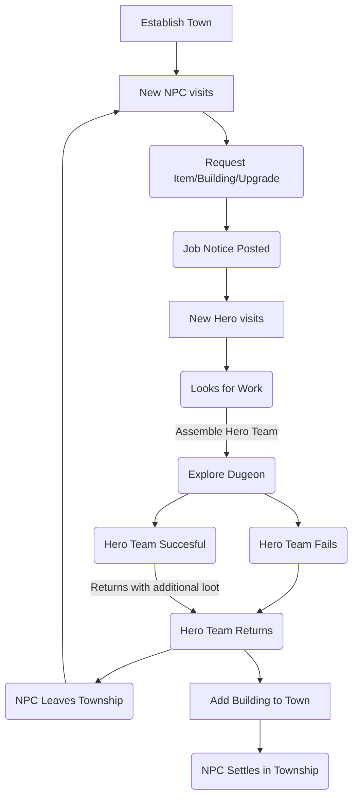

## About

Knightingale Township is a work in progress town management game set in an original fantasy world. It will feature hero collection mechanics, roguelike elements, and dungeon exploration as you the player grow and manage the town and its inhabitants.

## 🧐 Key Features

- Town building with various required & optional buildings
  - Upgradable buildings
- Resoruce gathering
  - Resouce mangement
- Quest System via NPC posting on town message board
- Quest System via NPC visiting tavern
- Hero collection via heroes visting tavern

### Town Management Systems

Information Coming Soon

### Hero Collection

- Heroes all start at the same base tier
- Hero rarity tied to town level
  > The higher level your town the more rare heroes will appear in the tavern.

### Dungeon Exploration

Information Coming Soon

## Gameplay Loop

## Around The Internet

<!-- - Follow the development of [Project Knightingale Township](https://open.codecks.io/knightingale-township) -->
- Find my games on Itch.io under [Margaret Cattter Development](https://margaretcatter.itch.io/)
- Keep update on my projects on Cohost under [As Always Imani](https://cohost.org/asalwaysimani)
- Support my projects by buying me milk & cookies on Ko-fi under [As Always Imani](https://ko-fi.com/asalwaysimani)
<!-- - Follow my general creative account [As Always Imani on Twitter](https://twitter.com/asalwaysimani) -->

## Credits

- Placeholder sprites where created by [Deji](https://dejinyucu.itch.io/) and can be found on the [lemmasoft forums](https://lemmasoft.renai.us/forums/viewtopic.php?t=29421).
- Placeholder background where created by [Vision Renders](https://twitter.com/Vision_Renders) and can be found on [itch.io](https://vision-renders.itch.io/)